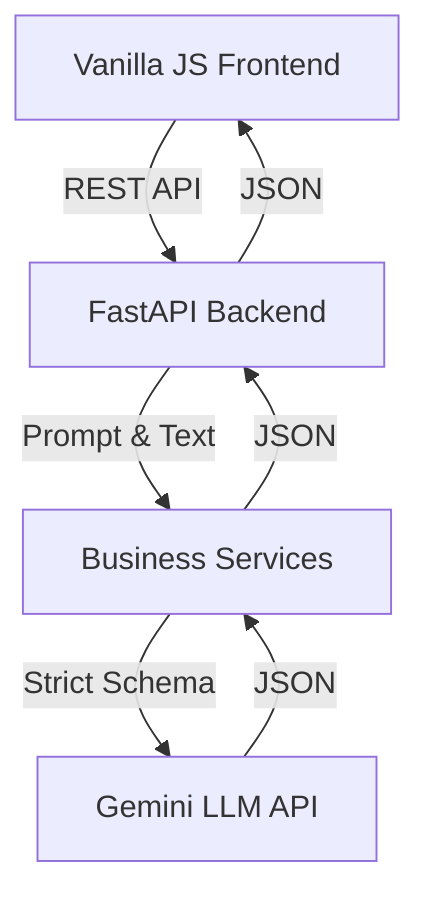
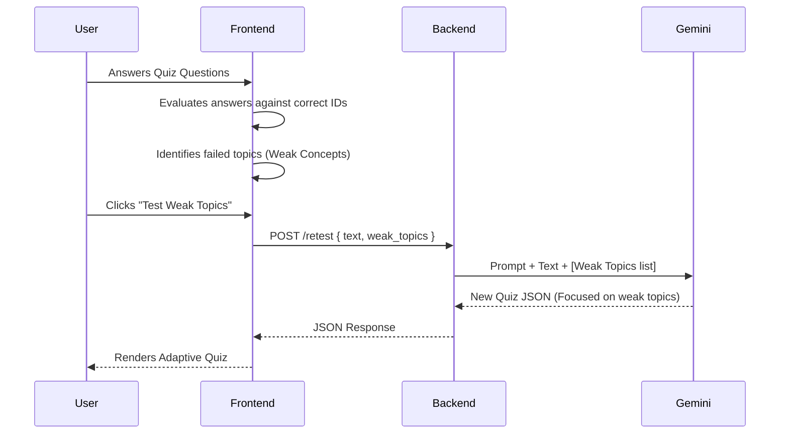
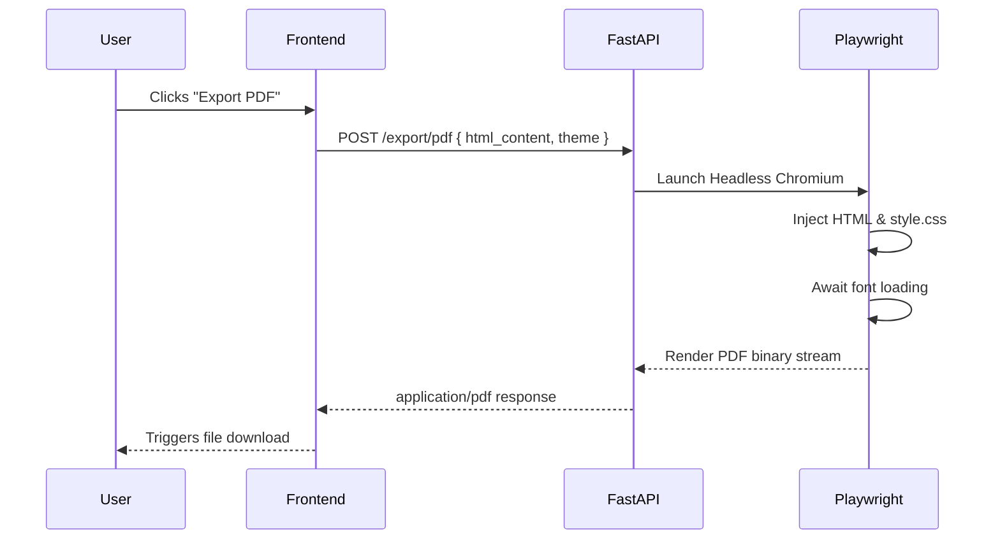

# System Architecture

MindCraft AI is built on a **Stateless Client-Server Monolith** pattern. This architecture completely decouples the UI from the LLM generation logic while avoiding the complexity of a stateful database.

## 1. High-Level Overview

## 2. Frontend Subsystem (Vanilla JS)

The frontend is a lightweight Single Page Application (SPA) utilizing raw HTML5, CSS3, and ES6 JavaScript.

- **State Management:** `main.js` holds the application state (uploaded text, active flashcards, quiz scores) in memory. This ensures sub-millisecond UI updates and eliminates loading spinners for local state transitions.
- **Network Layer:** `api.js` is exclusively responsible for asynchronous `fetch` calls. It wraps API responses into predictable Promises and throws unified errors.
- **Theming:** `style.css` uses CSS Variables to define tokens (colors, spacing, shadows). Switching themes simply swaps the `data-theme` attribute on the `<body>`, triggering instantaneous repaints.
- **Markdown Rendering:** Responses containing LLM-generated markdown are parsed via `marked.js` before being injected into the DOM.

## 3. Backend Subsystem (FastAPI)

The backend is built with Python 3.11 and FastAPI, chosen for its native async support and seamless Pydantic integration.

- **Controllers (`app/api/v1/`):** Define the HTTP routes, request validation, and HTTP status code mappings.
- **Services (`app/services/`):** Contain the core business logic. They orchestrate the flow of data between the controller, the prompt builders, and the LLM SDK.
- **Schemas (`app/schemas/`):** Pydantic models that serve a dual purpose:
  1. Validating incoming HTTP requests.
  2. Dictating the exact JSON schema that the Google Gemini API must return.
- **Prompts (`app/prompts/`):** Python files containing the highly tuned system instructions for each feature.

## 4. Feature Pipelines

### The "Weak Concept" Retest Loop
The most sophisticated data flow in the system is the Adaptive Revision engine.

### PDF Export Pipeline

## 5. Security & Validation

- **No Prompt Injection Execution:** The LLM is instructed to treat all user text as untrusted. Furthermore, because the output is rigidly cast into Pydantic models (JSON) and parsed safely by the frontend, standard SQL/Prompt injections cannot execute arbitrary code.
- **CORS Policies:** Configured via `pydantic-settings` to strictly allow only the Vercel production domain or local development ports.
- **Error Obfuscation:** The backend intercepts all upstream LLM timeouts, parsing errors, or Playwright crashes and returns sanitized `HTTP 500` messages to the client, preventing stack trace leaks.
